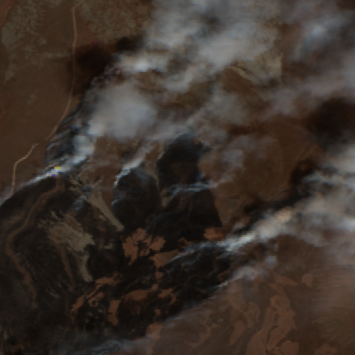
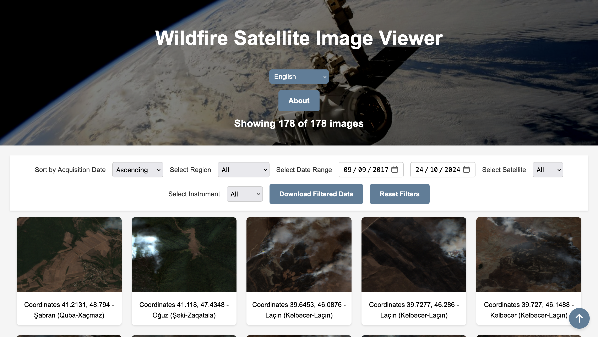
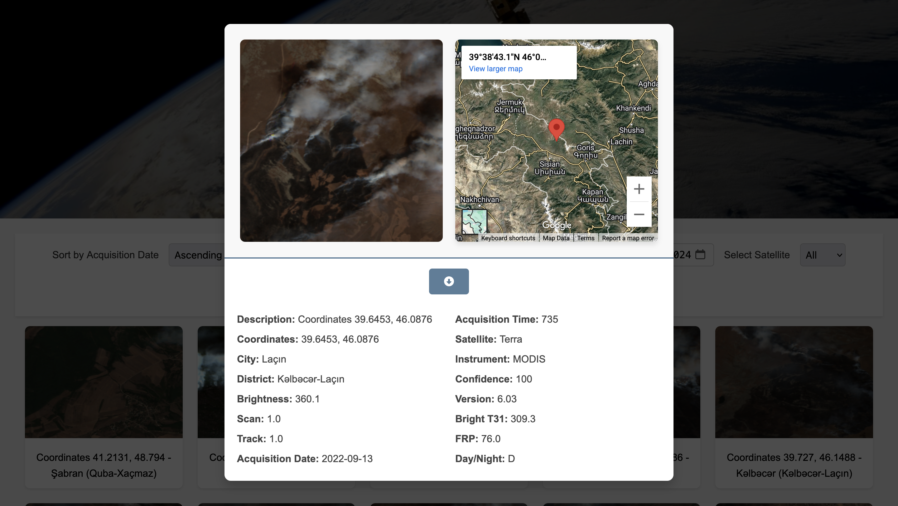
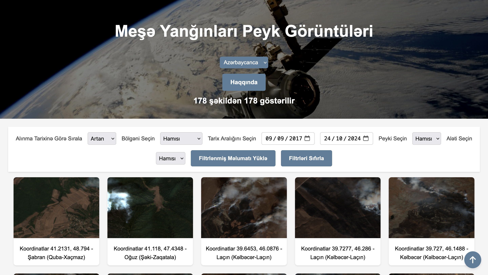
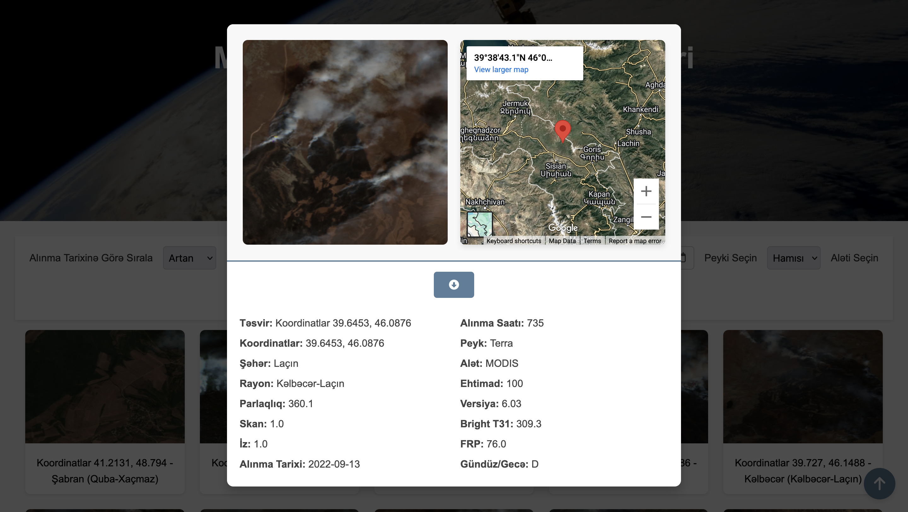
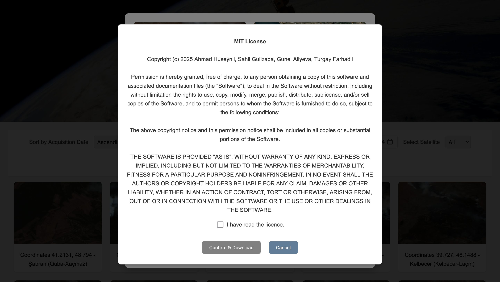
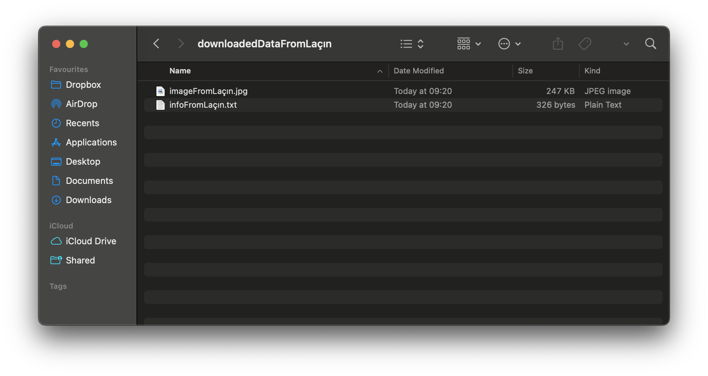
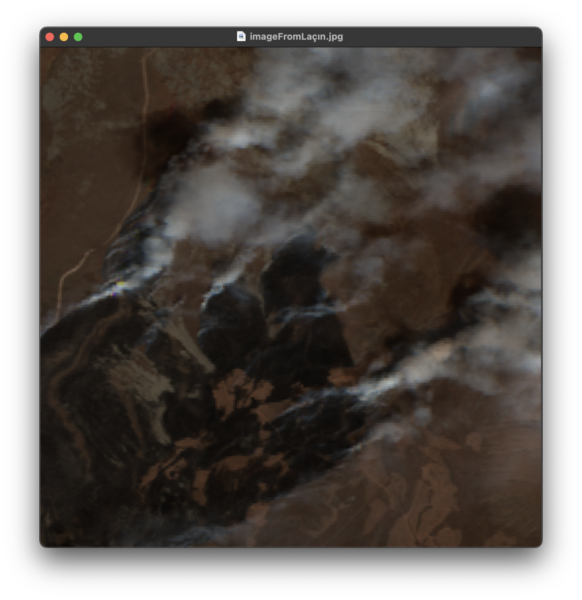
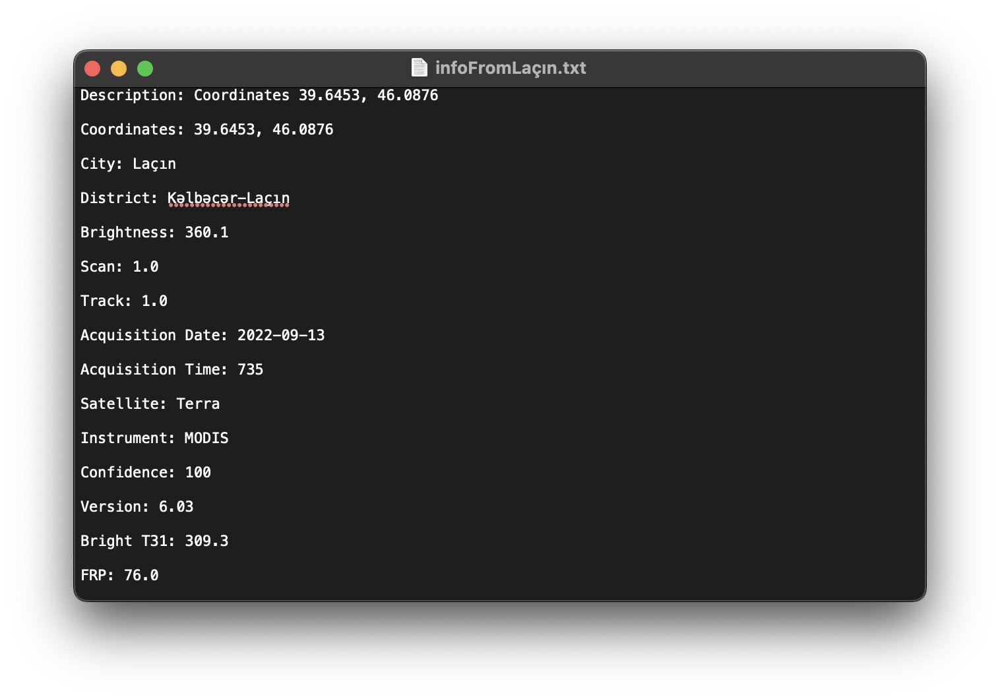

# 🔥 Wildfire Satellite Imagery Gallery

An open-access, lightweight web app that turns raw NASA FIRMS wildfire data into an interactive image gallery.  
Built so **anyone**—from researchers to the curious public—can explore, filter, and download satellite snapshots of fires across Azerbaijan in just a few clicks.

  

---

## 🌟 Why This Project?

- **Make wildfire data tangible** — Images say more than latitude/longitude pairs.
- **Keep it simple** — No backend, no log-in, zero friction. Just static HTML/CSS/JS served straight from GitHub Pages.
- **Stay open** — Source, dataset links, and downloads are free under the MIT License.

---

## ✨ Key Features

| Feature | What it gives you |
|---------|------------------|
| 🖼️ **Gallery view** | Browse 500 + satellite images, auto-generated from the unified CSV. |
| 🔍 **Dynamic filters & sort** | Narrow results by region, date, confidence, and more—image counter updates live. |
| 🗺️ **Location modal** | Click a thumbnail to open a modal with a larger image **+** an embedded Google Map pinpointing the fire. |
| 📦 **One-click ZIP export** | Download a single image or an entire filtered set (images + TXT metadata) after accepting the MIT license. |
| 🌐 **Bilingual UI** | Instant switch between **English** and **Azerbaijani** via i18next; auto-reload ensures full translation. |
| 🚀 **Pure front-end stack** | Runs everywhere—desktop, mobile, even offline once cached. |

---

## 🗂️ Data Pipeline in a Nutshell

1. **Source**: Multiple CSVs + imagery from **NASA FIRMS**.  
2. **Python pre-processing** (≈5 functions):  
   - Merge 50 k + rows → single master CSV  
   - Remove empty entries, pair rows with 583 images  
3. **Static deploy**: Final CSV & images live inside `/data` and `/images` folders—ready for the JS gallery loader.

---

## 🛠️ Tech Stack

- **Front-end**: **HTML 5**, **CSS 3**, **JavaScript ES6**  
- **i18n**: **i18next** (JSON dictionaries)  
- **Maps**: Google Maps Embed API  
- **Build / CI**: GitHub Actions → GitHub Pages  
- **License**: MIT

---

## 📸 Screenshots of Website

| Main Gallery | Detail Modal |
|--------------|--------------|
|  |  |
|  |  |

---

## ⚖️ License Modal

| MIT License Confirmation Modal |
|--------------|
|  |

---

## 📥 Downloaded File Example

| .zip File's Content | Image | Detail |
|--------------|--------------|--------------|
|  |  |  |
